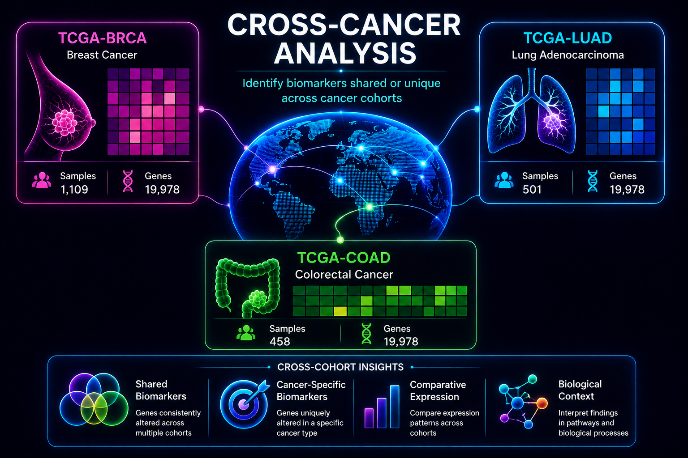
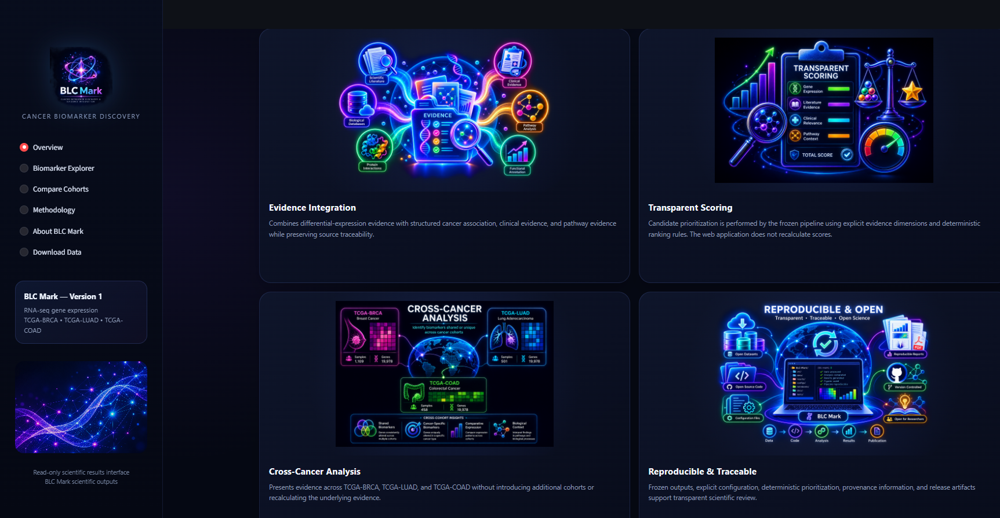
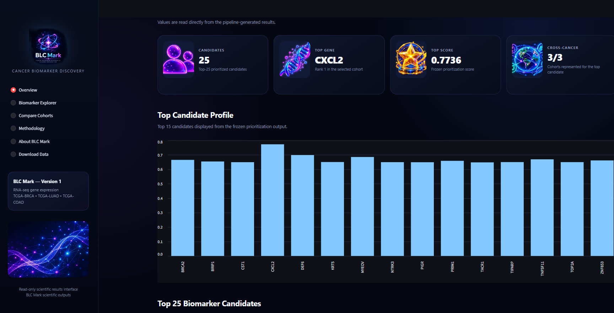
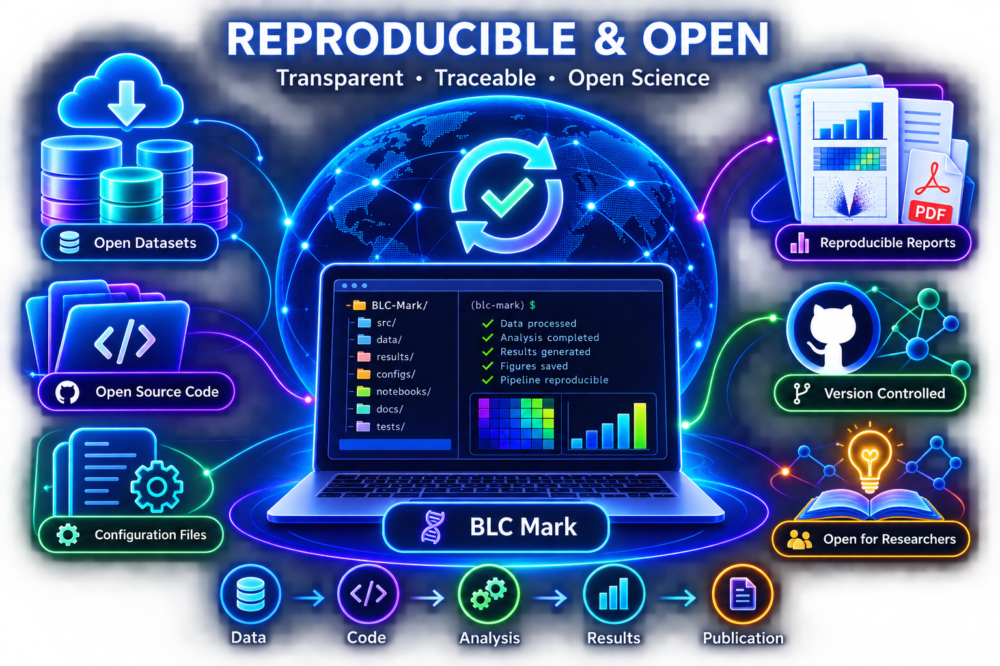
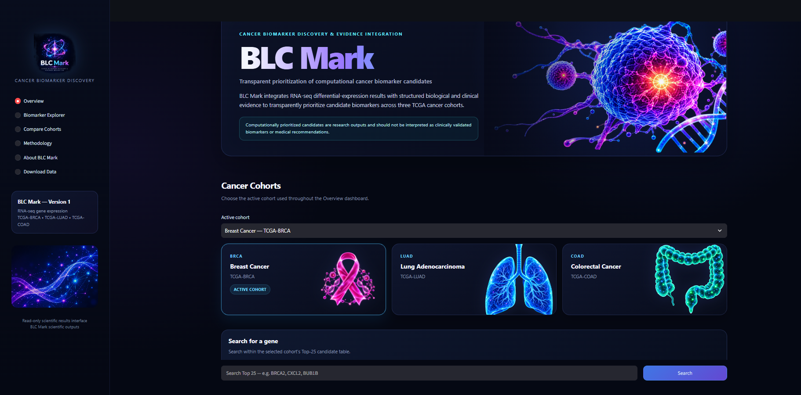
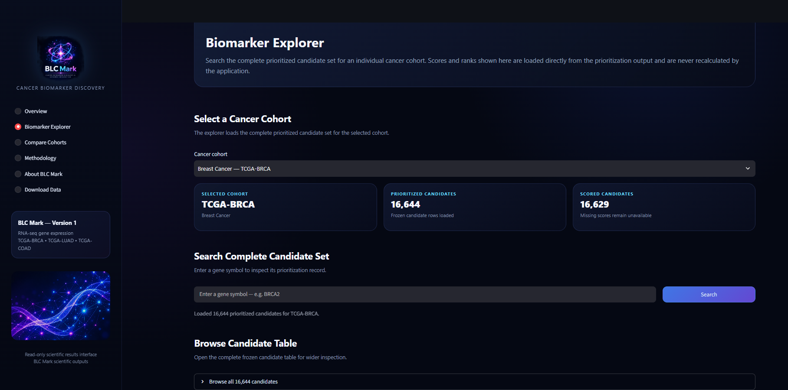

# BLC Mark

**From thousands of statistically significant genes to evidence-integrated biomarker candidates.**

BLC Mark is a research-oriented bioinformatics project for cancer biomarker discovery, evidence integration, and candidate prioritization using publicly available transcriptomic data.

Differential-expression analysis can identify thousands of statistically significant genes, but statistical significance alone does not determine which candidates warrant the greatest attention. BLC Mark addresses this problem by combining transcriptomic evidence with cancer-association, clinical/prognostic, and cross-cancer evidence through an explicit and reproducible prioritization framework.

Functional annotations and pathway information are retained alongside scored evidence to support biological interpretation. A publicly deployed Streamlit web application provides a read-only interface for exploring the completed analysis without recalculating or modifying the underlying results.

<p align="center">
  
</p>

## Live Web Application

BLC Mark is publicly available and can be explored directly in a web browser:

**[Open BLC Mark](https://blc-mark-web-kqsorr3nwabpmdbu3qbkl2.streamlit.app/)**

No local installation is required to explore the deployed results.

The website may be useful to students learning bioinformatics, genomics, or cancer biology; researchers interested in inspecting the prioritized candidates from the analyzed cohorts; computational-biology learners interested in evidence integration and ranking; and anyone who wants to explore the completed BLC Mark analysis through an interactive interface.

---

## Research Question

The central question behind BLC Mark is:

> **Can publicly available transcriptomic cancer datasets be integrated with complementary biological and clinical evidence to systematically prioritize cancer biomarker candidates in a transparent and reproducible way?**

BLC Mark does not attempt to replace experimental or clinical biomarker validation.

Instead, it acts as a computational prioritization framework: beginning with transcriptomic differences between tumor and normal samples, integrating additional evidence for statistically significant genes, and ranking candidates according to a predefined and inspectable scoring system.

---

## Why I Built It

One of the main challenges I encountered while working with transcriptomic cancer data was that differential-expression analysis does not naturally end with a small list of obvious biomarkers.

Depending on the dataset and statistical threshold, thousands of genes may remain statistically significant even after multiple-testing correction.

That raised a more interesting question:

> **How should those genes be prioritized?**

A gene with a large expression difference may be interesting, but several additional questions are also relevant:

- Is the gene already associated with the cancer being studied?
- Is clinical or prognostic evidence available for it?
- Does it recur among candidates in more than one analyzed cancer cohort?
- What is known about its biological function?
- Which pathways is it associated with?
- Is supporting evidence actually absent, or was it unavailable?

BLC Mark grew from trying to bring these pieces into one workflow without hiding how the final ranking was produced.

---

## Version 1 Scope

BLC Mark Version 1 analyzes three TCGA cancer cohorts:

| Cancer type | Cohort |
|---|---|
| Breast Cancer | TCGA-BRCA |
| Lung Adenocarcinoma | TCGA-LUAD |
| Colorectal Cancer | TCGA-COAD |

Version 1 is intentionally limited to RNA-seq gene-expression analysis.

The goal was to build a transparent and reproducible analysis pipeline before expanding into additional cancer types, molecular layers, or validation strategies.

<table>
<tr>
<td align="center" width="33%">
<br>
<strong>TCGA-BRCA</strong><br>
Breast Cancer
</td>
<td align="center" width="33%">
<br>
<strong>TCGA-LUAD</strong><br>
Lung Adenocarcinoma
</td>
<td align="center" width="33%">
<br>
<strong>TCGA-COAD</strong><br>
Colorectal Cancer
</td>
</tr>
</table>

---

# Scientific Workflow

BLC Mark was developed as a six-stage workflow:

```text
Scientific & Engineering Foundation
                ↓
Data Acquisition & Preparation
                ↓
Differential Expression
                ↓
Evidence Integration
                ↓
Biomarker Prioritization
                ↓
Scientific Outputs & Reproducibility
```

Each stage has a defined scientific responsibility and produces structured outputs used by later stages.

---

## Phase 1 — Scientific & Engineering Foundation

Before implementing the analysis, I defined the scientific scope and several rules that the rest of the project would follow.

Core principles include:

- keep Version 1 scientifically limited;
- make analysis assumptions explicit;
- avoid silently changing statistical methods;
- validate inputs before analysis;
- preserve provenance where possible;
- distinguish unavailable information from evaluated negative evidence;
- produce machine-readable outputs;
- make ranking deterministic;
- fail explicitly when a requested analysis cannot be performed.

Differential expression, evidence integration, and biomarker prioritization are implemented as separate scientific responsibilities rather than being combined into one large analysis script.

---

## Phase 2 — Data Acquisition & Preparation

The data-preparation stage handles:

- dataset registration;
- expression-data acquisition;
- metadata acquisition;
- file-integrity handling;
- expression-data validation;
- metadata validation;
- sample matching;
- preprocessing;
- expression-representation tracking;
- quality-control information;
- provenance metadata.

The executed Version 1 analysis uses publicly available TCGA/Xena transcriptomic resources.

An important design decision was to keep data preparation separate from statistical analysis so that the differential-expression module receives an explicitly defined expression representation rather than attempting to infer the data type from numerical values.

---

## Phase 3 — Differential Expression & Candidate Discovery

For all three analyzed cohorts, the comparison is:

```text
Primary Tumor
     vs
Solid Tissue Normal
```

The executed Version 1 analysis uses:

- normalized log2 gene-expression values;
- Welch's unequal-variance two-sample t-test;
- two-sided statistical testing;
- Benjamini-Hochberg multiple-testing correction;
- adjusted p-value threshold of 0.05.

No default effect-size cutoff was added to the candidate-selection rule.

This was intentional. Differential expression is treated as a statistical candidate-discovery step rather than silently introducing additional ranking criteria.

### Differential-Expression Results

| Cohort | Genes tested | Significant candidates |
|---|---:|---:|
| TCGA-BRCA | 20,530 | 16,644 |
| TCGA-LUAD | 20,530 | 16,031 |
| TCGA-COAD | 20,530 | 15,468 |

These results illustrate why BLC Mark does not stop at differential expression.

Even after multiple-testing correction, each cohort contains a large candidate set. Significant genes therefore become the input to evidence integration rather than being described directly as validated biomarkers.

### Why Welch's t-test?

The executed Version 1 datasets are analyzed using normalized log2 expression rather than raw RNA-seq counts.

For that reason, the current analysis uses Welch's unequal-variance two-sample t-test. The differential-expression module explicitly tracks the expression representation being analyzed and does not attempt to infer it from numerical values.

Raw-count RNA-seq analysis represents a different statistical situation. Count-specific methods such as DESeq2 belong to a different workflow from the normalized-log2 analysis executed in Version 1, so BLC Mark does not silently substitute between these analysis types.

For the executed normalized-log2 analyses, the recorded expression effect represents the difference in mean log2 expression between the comparison groups.

---

## Phase 4 — Evidence Integration

Differential expression identifies genes whose expression differs between the two sample groups. It does not, by itself, establish how biologically or clinically interesting those genes are.

Phase 4 connects significant candidates to additional evidence dimensions.

### Cancer-Association Evidence

Cancer-association information is integrated using the Open Targets Platform.

This provides structured evidence concerning associations between candidate genes and the cancer context being analyzed.

### Clinical and Prognostic Evidence

Clinical/prognostic evidence is integrated from the Human Protein Atlas.

The project retains prognostic category and direction where available. Source-derived evidence categories include:

- Unprognostic
- Potential prognostic
- Validated prognostic

Favorable and unfavorable prognostic directions are also retained.

These categories reproduce evidence from the integrated source and should not be interpreted as independent clinical validation performed by BLC Mark.

### Cross-Cancer Evidence

BLC Mark checks whether a candidate occurs among significant genes in the other analyzed cohorts.

Version 1 cross-cancer evidence therefore refers specifically to recurrence among:

- TCGA-BRCA
- TCGA-LUAD
- TCGA-COAD

It should not be interpreted as pan-cancer evidence.

<p align="center">
  
</p>

<p align="center"><em>Conceptual illustration of the three-cohort cross-cancer analysis used in Version 1.</em></p>

### Functional Annotation

Functional descriptions are retained using NCBI-derived gene information.

These annotations provide biological context for investigating ranked candidates but do not directly increase the Version 1 prioritization score.

### Pathway Context

Reactome pathway information is retained where available.

As with functional annotation, pathway information provides supporting context rather than acting as a direct scoring component in Version 1.

### Evidence Provenance

The evidence-integration stage retains structured information such as:

- gene identifier;
- evidence type;
- evidence source;
- source version where available;
- evidence identifier;
- evidence description;
- source-specific values.

This allows the evidence underlying a candidate to remain inspectable rather than exposing only its final prioritization score.

### Missing Evidence

Missing evidence creates an important distinction.

If a candidate cannot be resolved against an external evidence source, assigning that candidate a score of 0 would imply that the candidate was successfully evaluated and no supporting evidence was found.

That is different from the evidence being unavailable or unable to be evaluated.

BLC Mark therefore distinguishes **unavailable evidence** from **evaluated zero evidence**. This distinction is preserved during biomarker prioritization.

---

## Phase 5 — Biomarker Prioritization

Version 1 uses four scoring components:

| Component | Weight |
|---|---:|
| Differential-expression strength | 0.25 |
| Cancer-association evidence | 0.25 |
| Clinical/prognostic evidence | 0.25 |
| Cross-cancer evidence | 0.25 |

The final score is calculated as:

```text
Final Score =
    0.25 × DE Score
  + 0.25 × Cancer Association Score
  + 0.25 × Clinical Score
  + 0.25 × Cross-Cancer Score
```

Equal weights were deliberately retained for Version 1.

The project does not currently have sufficient independent validation data to justify claiming that one evidence dimension should receive substantially greater weight than another. Configurable or empirically optimized weighting strategies are therefore left for future work.

<p align="center">
  
</p>

### Differential-Expression Score

Differential-expression evidence incorporates the magnitude of the recorded expression effect within the candidate set.

The prioritization framework uses the absolute magnitude of the expression effect because both strong increases and strong decreases in expression may be biologically relevant.

### Cancer-Association Score

Cancer-association evidence is derived from the Open Targets evidence collected for the candidate and cancer context.

This component remains separate from differential-expression evidence so that transcriptomic effect size and existing cancer-association evidence remain distinct dimensions of the prioritization framework.

### Clinical Score

Human Protein Atlas prognostic categories are mapped into the Version 1 clinical evidence score:

| Source-derived category | Score |
|---|---:|
| Unprognostic | 0.0 |
| Potential prognostic | 0.5 |
| Validated prognostic | 1.0 |

Favorable versus unfavorable prognostic direction does not alter the evidence-strength score.

These categories represent integrated source evidence and do not constitute independent clinical validation by BLC Mark.

### Cross-Cancer Score

Cross-cancer evidence is based on recurrence among the three analyzed Version 1 cohorts:

| Recurrence | Score |
|---|---:|
| Candidate in 1 cohort | 0.0 |
| Candidate in 2 cohorts | 0.5 |
| Candidate in 3 cohorts | 1.0 |

This mapping should be interpreted only within the three-cohort scope of Version 1.

### Deterministic Ranking

Candidates with complete scores are ranked from highest final score to lowest.

If two candidates have exactly the same final score, the tie is resolved using `gene_id` in ascending order.

This prevents ranking order from changing arbitrarily between repeated executions.

Candidates that cannot receive a valid final score because required evidence is unavailable are not deleted. They remain in the results with unavailable score and rank values.

### Prioritization Results

All significant differential-expression candidates are retained during prioritization.

| Cohort | DE candidates | Prioritization candidates | Scored | Score unavailable |
|---|---:|---:|---:|---:|
| TCGA-BRCA | 16,644 | 16,644 | 16,629 | 15 |
| TCGA-LUAD | 16,031 | 16,031 | 16,018 | 13 |
| TCGA-COAD | 15,468 | 15,468 | 15,457 | 11 |

Candidates with unavailable scores remain in the result set rather than being silently removed or assigned artificial values.

### Top-Ranked Candidates

The highest-ranked candidate under the Version 1 BLC Mark scoring framework in each analyzed cohort is:

| Cohort | Top candidate | Final score |
|---|---|---:|
| TCGA-BRCA | CXCL2 | 0.7736 |
| TCGA-LUAD | BUB1B | 0.8215 |
| TCGA-COAD | GOLGA7B | 0.7244 |

Selected top-ranked candidates:

| Rank | TCGA-BRCA | TCGA-LUAD | TCGA-COAD |
|---:|---|---|---|
| 1 | CXCL2 | BUB1B | GOLGA7B |
| 2 | DEF6 | RAD51 | DSC2 |
| 3 | MYEOV | TUBA1C | TLX1 |
| 4 | TNFSF11 | MYBL2 | DPP7 |
| 5 | BRCA2 | BIRC5 | SLC4A4 |
| 6 | ZNF853 | FOXM1 | ATOH1 |
| 7 | PRIM1 | BRCA1 | FES |
| 8 | BRIP1 | KIF14 | TPSG1 |
| 9 | KRT5 | PLK1 | ANO7 |
| 10 | TIPARP | ANLN | EEF1A2 |

These rankings should not be interpreted as claims that these genes are clinically validated biomarkers.

They represent the highest-priority candidates under the current BLC Mark computational scoring framework.

<p align="center">
  
</p>

<p align="center"><em>Example cohort dashboard showing the Top-25 summary and Top-15 prioritization-score profile.</em></p>

---

## Phase 6 — Scientific Outputs & Reproducibility

The final workflow stage generates consistent scientific outputs from the completed prioritization results.

Outputs include:

- final candidate tables;
- figures;
- a scientific report;
- reproducibility metadata;
- artifact-integrity information.

### Final Tables

```text
results/phase6/tables/
├── brca_top_25_biomarkers.csv
├── luad_top_25_biomarkers.csv
├── coad_top_25_biomarkers.csv
└── combined_top_25_biomarkers.csv
```

The combined table contains 75 candidate records: 25 from each analyzed cohort.

### Figures

```text
results/phase6/figures/
├── brca_top_15_biomarkers.png
├── luad_top_15_biomarkers.png
├── coad_top_15_biomarkers.png
└── cross_cohort_top_15_score_profiles.png
```

The cohort figures display the highest-ranked candidates and their final prioritization scores. The cross-cohort figure provides a comparison of score profiles across BRCA, LUAD, and COAD.

### Scientific Report

The generated scientific results report is stored at:

```text
results/phase6/report/BLC_Mark_V1_scientific_report.md
```

The report brings together study design, cohort results, prioritization results, interpretation, missing-evidence handling, limitations, and reproducibility information.

It is generated from project outputs rather than manually reconstructing numerical results.

### Reproducibility

Reproducibility was treated as a core design requirement rather than something added only at the end of the project.

<p align="center">
  
</p>

BLC Mark records information such as:

- analysis configuration;
- dataset provenance;
- comparison groups;
- statistical method;
- multiple-testing procedure;
- candidate counts;
- evidence sources;
- scoring configuration;
- QC information;
- software environment;
- generated-output metadata;
- output-file hashes.

The final workflow creates:

```text
results/phase6/reproducibility/phase6_reproducibility_manifest.json
```

The manifest records generated scientific artifacts together with SHA-256 hashes.

A final Version 1 integrity audit verified all recorded Phase 6 release artifacts:

```text
Missing files:       0
Size mismatches:     0
SHA-256 mismatches:  0
```

This provides an integrity check for the generated release artifacts.

### Recorded Analysis Environment

The Phase 6 reproducibility manifest records:

```text
Python:   3.14.6
pandas:   3.0.5
SciPy:    1.18.1
Platform: Windows 11
```

### Regenerating Scientific Outputs

The final tables, figures, report, and reproducibility manifest can be regenerated with:

```bash
python scripts/run_phase6.py
```

The runner executes:

```text
generate_phase6_tables.py
          ↓
generate_phase6_figures.py
          ↓
generate_phase6_report.py
          ↓
generate_phase6_manifest.py
```

This process operates on the existing completed analysis and prioritization outputs.

It intentionally does not rerun data acquisition, differential expression, external evidence retrieval, or biomarker prioritization. Keeping these stages separate prevents changes in external sources from silently altering the scientific results represented by a completed release.

---

# Interactive Web Application

The public website is the main interactive interface for exploring BLC Mark:

### **[Launch BLC Mark](https://blc-mark-web-kqsorr3nwabpmdbu3qbkl2.streamlit.app/)**

The web application is intended for anyone interested in exploring the project, but it may be particularly useful for:

- students learning bioinformatics, genomics, transcriptomics, or cancer biology;
- researchers who want to inspect prioritized candidates from the three analyzed cohorts;
- computational-biology learners interested in how differential expression, external evidence, and ranking can be connected in one workflow;
- users who want to explore the completed BLC Mark results without working directly with the underlying files.

The interface provides:

- a project overview;
- cohort-level Top-25 results;
- biomarker search across the complete prioritized candidate set;
- cross-cohort comparison;
- methodology and project-scope information;
- downloadable scientific outputs.

<p align="center">
  
</p>

<p align="center"><em>BLC Mark overview dashboard showing the three analyzed cancer cohorts.</em></p>

The application is a **read-only exploration layer** over the completed analysis. It does not rerun differential expression, retrieve new external evidence, recalculate component scores, modify final scores, change ranks, or replace unavailable scores with zero.

This is deliberate: browsing the website should not change the scientific results being presented.

---

## Biomarker Explorer

The Biomarker Explorer allows users to select an analyzed cancer cohort and search the complete prioritized candidate set for an individual gene.

<p align="center">
  
</p>

Displayed candidate information can include:

- gene identifier;
- cohort;
- rank;
- final prioritization score;
- expression effect size;
- adjusted p-value;
- clinical evidence category;
- cross-cancer recurrence information;
- pathway information.

For example, CXCL2 appears as a significant candidate in all three analyzed cohorts:

| Cohort | Rank | Final score | Expression effect | Adjusted p-value | Cross-cancer cohort count |
|---|---:|---:|---:|---:|---:|
| TCGA-BRCA | 1 | 0.773594 | -4.536848 | 2.37e-86 | 3 |
| TCGA-LUAD | 1453 | 0.489206 | -2.365060 | 5.69e-14 | 3 |
| TCGA-COAD | 1415 | 0.475098 | 1.908907 | 6.67e-13 | 3 |

This illustrates an important distinction in the project: recurrence across cohorts contributes evidence, but a candidate can have substantially different rankings and expression effects in different cancer contexts.

---

## Downloadable Results

The Download Data page provides downloadable representations of the completed Phase 6 scientific outputs.

Users can download:

- BRCA Top-25 candidate table — CSV or PDF;
- LUAD Top-25 candidate table — CSV or PDF;
- COAD Top-25 candidate table — CSV or PDF;
- combined 75-row Top-25 table — CSV or PDF;
- Version 1 scientific report — Markdown;
- Phase 6 reproducibility manifest — JSON.

CSV files provide machine-readable versions of the fixed Top-25 result tables. PDF exports provide human-readable summaries generated from those same tables.

**The downloadable CSV and PDF files are fixed Phase 6 Top-25 outputs.** Searching for a gene in the Biomarker Explorer does not dynamically change these downloadable files or generate a separate export for the searched biomarker.

Generating a PDF does not recalculate, normalize, score, rank, or otherwise alter the scientific results.

---

## Running the Application Locally

The public website is the main user-facing version of BLC Mark. Local execution is also available for people who want to inspect the source code or run the interface from the repository.

```bash
streamlit run streamlit_app.py
```

---

# Repository Structure

The following is an abridged view of the main project structure:

```text
BLC Mark/
│
├── assets/
│   ├── blc_mark_hero.png
│   ├── blc_mark_logo.png
│   ├── breast_cancer.png
│   ├── colorectal_cancer.png
│   ├── lung_cancer.png
│   ├── reproducibility_icon.png
│   ├── app_overview.png
│   ├── app_top_candidates.png
│   ├── app_methodology_cards.png
│   ├── app_biomarker_explorer.png
│   ├── cross_cancer_analysis.png
│   └── additional interface artwork
│
├── data/
│
├── docs/
│   ├── biomarker_prioritization_specification.md
│   ├── differential_expression_specification.md
│   ├── modules.md
│   ├── mvp_checklist.md
│   └── tech_stack.md
│
├── results/
│   ├── phase3/
│   ├── phase4/
│   ├── phase5/
│   └── phase6/
│
├── scripts/
│   ├── extract_open_targets.py
│   ├── generate_phase6_figures.py
│   ├── generate_phase6_manifest.py
│   ├── generate_phase6_report.py
│   ├── generate_phase6_tables.py
│   ├── phase4_run.py
│   ├── phase4_smoke_test.py
│   └── run_phase6.py
│
├── src/
│   ├── differential_expression/
│   ├── evidence_integration/
│   ├── biomarker_prioritization/
│   └── supporting project modules
│
├── tests/
│
├── .gitignore
├── LICENSE
├── README.md
├── requirements.txt
└── streamlit_app.py
```

Local development folders such as `.venv/`, `.pytest_cache/`, and `__pycache__/` are intentionally not part of the conceptual repository structure shown above.

---

## Main Source Packages

### `src/differential_expression/`

Contains the differential-expression implementation, including:

- analysis orchestration;
- comparison definition;
- configuration;
- statistical methods;
- gene filtering;
- multiple-testing correction;
- validation;
- QC;
- result models;
- reproducibility information.

### `src/evidence_integration/`

Contains the evidence-integration implementation, including:

- candidate handling;
- identifier resolution;
- Open Targets integration;
- Human Protein Atlas prognostic evidence;
- NCBI functional annotation;
- Reactome pathway evidence;
- cross-cancer evidence;
- evidence aggregation;
- provenance;
- validation;
- QC.

### `src/biomarker_prioritization/`

Contains:

- prioritization configuration;
- component scoring;
- candidate models;
- deterministic ranking;
- validation;
- QC;
- structured result generation.

Keeping these stages separate makes it easier to test and inspect each scientific responsibility independently.

---

# Installation

Clone the repository and move into the project directory.

Create a virtual environment:

```bash
python -m venv .venv
```

On Windows PowerShell:

```powershell
.\.venv\Scripts\Activate.ps1
```

Install dependencies:

```bash
pip install -r requirements.txt
```

The project uses packages including:

- pandas
- NumPy
- requests
- Jupyter
- Matplotlib
- SciPy
- Streamlit
- pytest
- ReportLab

ReportLab is used for PDF-export functionality in the Streamlit application.

---

# Testing

The project contains automated tests covering differential expression, evidence integration, biomarker prioritization, validation, quality control, and reproducibility behavior.

Run the complete test suite with:

```bash
python -m pytest -q
```

Final Version 1 publication-QA run:

```text
354 passed in 16.50s
```

The test suite covers areas including:

- configuration validation;
- comparison construction;
- statistical methods;
- multiple-testing correction;
- differential-expression results;
- candidate handling;
- identifier resolution;
- external evidence integration;
- NCBI annotation;
- Reactome pathways;
- cross-cancer evidence;
- evidence aggregation;
- provenance;
- prioritization configuration;
- component scoring;
- missing-evidence handling;
- deterministic ranking;
- QC;
- reproducibility behavior.

---

# Why TCGA-OV Was Not Included

Ovarian cancer (TCGA-OV) was considered during development.

The Version 1 comparison was defined consistently as:

```text
Primary Tumor
     vs
Solid Tissue Normal
```

The selected ovarian cancer dataset did not provide the required Solid Tissue Normal samples for this comparison.

Rather than changing the scientific design only for one cohort, TCGA-OV was excluded from the executed Version 1 analysis.

The project therefore did not:

- treat recurrent tumor samples as normal;
- substitute another tissue type;
- introduce an external normal cohort without a harmonization strategy;
- change the comparison only for ovarian cancer.

The final analyzed cohort set therefore consists of BRCA, LUAD, and COAD.

This decision is documented because explicit exclusion is preferable to silently changing the study design in order to retain an additional dataset.

---

# Key Design Decisions

### Missing evidence is not zero evidence

An unresolved identifier or unavailable evidence source should not automatically be interpreted as evidence of no support.

### Statistical significance is not biomarker validation

Differential expression produces candidates. It does not establish clinical biomarker validity.

### Ranking should be deterministic

Exact score ties use a defined rule rather than depending on dataframe ordering.

### Evidence should remain inspectable

The final score provides a useful summary, but the underlying evidence dimensions are retained so that prioritization does not become a black box.

### Biological context is not automatically scoring evidence

Functional descriptions and pathway annotations can help researchers interpret candidates, but including every available annotation in the numerical score would make the scoring framework harder to justify.

### Scientific failures should remain visible

If an analysis cannot be performed under the defined configuration, the pipeline should fail explicitly rather than silently changing statistical methods or comparison groups.

### The interface should not change the analysis

The Streamlit application presents existing results but does not recalculate the scientific pipeline.

---

# Project Use & Disclaimer

BLC Mark is an **educational and research-oriented computational project**. The public website presents results generated by the Version 1 pipeline and is intended for exploration, learning, and hypothesis generation.

The rankings are **not clinical recommendations** and should not be used for diagnosis, treatment decisions, or patient care.

The project has been tested and its final release artifacts were checked for integrity, but—as with any research software or data-analysis project—limitations or implementation errors may still exist. Results should therefore be interpreted alongside the documented methodology, assumptions, and limitations rather than treated as independently validated biological or clinical conclusions.

---

# Limitations

BLC Mark Version 1 has several important limitations.

### RNA-seq Only

The current project uses gene-expression data only.

It does not yet integrate mutation, copy-number variation, methylation, proteomic, or other molecular data.

### Statistical Model

The executed differential-expression analysis uses Welch's t-test on normalized log2 expression.

A raw-count RNA-seq workflow using a count-specific statistical model represents a different analysis design and may produce different candidate sets.

### Three Cancer Cohorts

Cross-cancer recurrence is currently evaluated only across BRCA, LUAD, and COAD.

It should not be interpreted as evidence of recurrence across all cancer types.

### Evidence Availability

External evidence sources do not provide equal coverage for every gene.

This is one reason unavailable evidence is distinguished from evaluated zero evidence.

### Fixed Scoring Weights

The four Version 1 scoring components use equal weights.

These weights are transparent and reproducible, but they have not been learned or optimized against an independently validated biomarker dataset.

### No Independent-Cohort Validation Yet

The current rankings have not yet been validated using an independent patient cohort.

### No Experimental or Clinical Validation

BLC Mark is a computational research project.

Its outputs should be interpreted as candidate prioritization for further investigation, not as diagnostic, prognostic, therapeutic, or clinical recommendations.

---

# Future Work

Potential future extensions include:

- independent-cohort validation;
- survival analysis;
- additional cancer cohorts;
- additional evidence sources;
- configurable scoring models;
- independently evaluated weighting strategies;
- raw-count differential-expression workflows;
- multi-omics integration;
- broader cross-cancer analysis.

These are future directions rather than partially implemented Version 1 features.

---

# Documentation

Detailed scientific and engineering decisions are documented under:

```text
docs/differential_expression_specification.md
docs/biomarker_prioritization_specification.md
docs/modules.md
docs/mvp_checklist.md
docs/tech_stack.md
```

The generated scientific report is available at:

```text
results/phase6/report/BLC_Mark_V1_scientific_report.md
```

---

# Scientific Interpretation

A high BLC Mark ranking means that a candidate received a high score **within the current computational evidence framework**.

It does not demonstrate:

- diagnostic accuracy;
- prognostic validity;
- therapeutic utility;
- causal involvement in cancer;
- prospective clinical performance;
- independent experimental validation.

Ranked candidates should therefore be treated as hypotheses for further investigation rather than established clinical biomarkers.

---

# Development Note

My undergraduate training is primarily in the life sciences, and coding is not a formal part of my coursework. I used AI-assisted tools while developing BLC Mark to help modify, debug, and refine parts of the code.

At the same time, I worked through the pipeline myself, tested the implementation, checked the scientific logic and outputs, and made an effort to understand what the code was doing rather than treating it as a black box.

Building BLC Mark has therefore also been part of how I am learning computational biology and scientific programming in practice.

---

# Data Sources & References

BLC Mark integrates publicly available transcriptomic and biological evidence resources. The following resources and methods were used in the Version 1 workflow.

## Data and Evidence Resources

1. **The Cancer Genome Atlas (TCGA)**  
   Cancer Genome Atlas Research Network. TCGA provides the cancer transcriptomic datasets underlying the analyzed cohorts.

2. **UCSC Xena**  
   Goldman MJ, et al. *Visualizing and interpreting cancer genomics data via the Xena platform.* Nature Biotechnology. 2020;38:675–678.  
   https://xenabrowser.net/

3. **Open Targets Platform**  
   Ochoa D, et al. *The next-generation Open Targets Platform: reimagined, redesigned, rebuilt.* Nucleic Acids Research. 2023;51(D1):D1353–D1359.  
   https://platform.opentargets.org/

4. **Human Protein Atlas**  
   Uhlén M, et al. *A pathology atlas of the human cancer transcriptome.* Science. 2017;357(6352):eaan2507.  
   https://www.proteinatlas.org/

5. **NCBI Gene**  
   National Center for Biotechnology Information. NCBI Gene.  
   https://www.ncbi.nlm.nih.gov/gene/

6. **Reactome**  
   Gillespie M, et al. *The Reactome pathway knowledgebase 2022.* Nucleic Acids Research. 2022;50(D1):D687–D692.  
   https://reactome.org/

## Statistical Methods

7. **Benjamini–Hochberg False Discovery Rate**  
   Benjamini Y, Hochberg Y. *Controlling the false discovery rate: a practical and powerful approach to multiple testing.* Journal of the Royal Statistical Society: Series B. 1995;57(1):289–300.

## License

Released under the [MIT License](LICENSE).


# Final Note

BLC Mark began with a fairly simple question: after differential-expression analysis produces thousands of significant genes, how can I make the next step more systematic?

As the project developed, the difficult parts were not only statistical. I had to think about what missing evidence means, how different evidence sources should be kept separate, how a ranking should behave when information is unavailable, why one cohort could not be analyzed under the same design, and how to make the final results traceable.

Version 1 is intentionally limited. It does not claim to discover clinically validated biomarkers. Its purpose is to provide a transparent way to move from large differential-expression candidate sets toward evidence-integrated priorities that can be inspected and investigated further.

For me, the project has also been a bridge between my life-science background and the computational side of biology.

## Author

**S.Sheryl**

B.Sc. Genetics • Biotechnology • Zoology • Biochemistry

BLC Mark is not intended to provide the final answer about which genes are biomarkers; it is an attempt to make the process of deciding which candidates deserve further investigation more transparent, reproducible, and inspectable.
